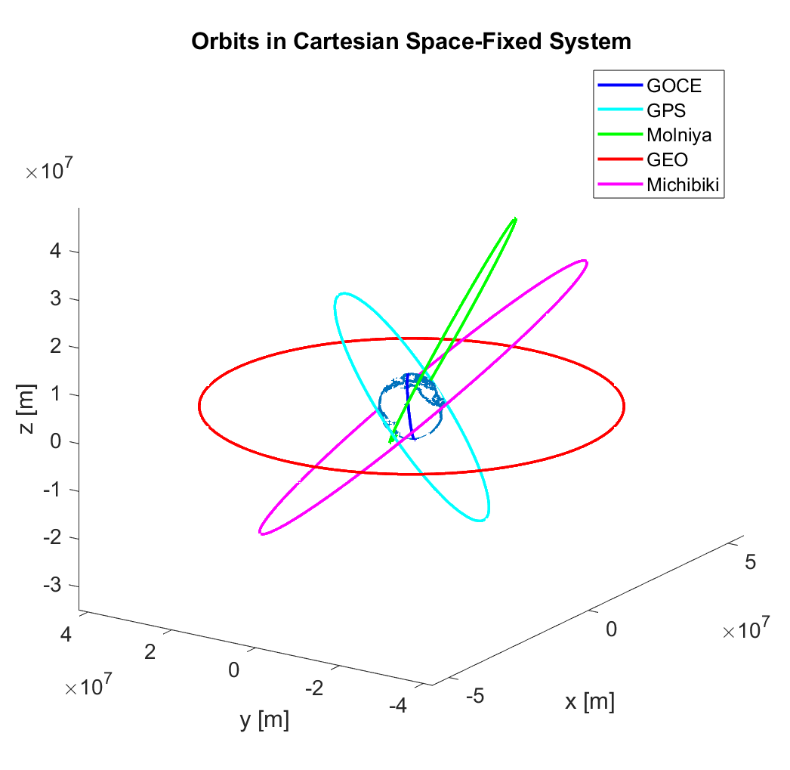

# orbits

A collection of utils and scripts to compute and visualize orbits. 

## Orbit Mechanics Labs
Practical exercises supporting the lecture (ESPACE 22/23, TUM)

### Keplerian Orbits in Space-fixed, Earth-fixed and Topocentric Systems
Orbits of GOCE, GPS, Molniya, Michibiki and a GEO satellite visualized as
- 3D in space fixed system
- 3D in earth fixed system
And resulting 
- groundtracks
- satellite visibility from Wettzell

  
Image results

 <table>
  <tr>
    <td>  </td>
    <td>  </td>
  </tr>
  <tr>
    <td>  </td>
    <td>  </td>
  </tr>
</table> 

### Numerical Integration of Satellite Orbits
Analysis of errors introduced by numberical integration of Sentinel-3.

  
Image results

 <table>
  <tr>
    <td>  </td>
    <td>  </td>
  </tr>
  <tr>
    <td>  </td>
    <td>  </td>
  </tr>
</table> 

## Advanced Orbit Mechanics Labs
Practical exercises supporting the lecture (ESPACE 23, TUM)

### TerraSAR & Tandem-X: Relative Motion and Hill Equations

  
Further results

 <table>
  <tr>
    <td>  </td>
    <td>  </td>
  </tr>
  <tr>
    <td colspan=2>  </td>
  </tr>
</table> 

### Integration of Satellite Orbits with Different Force Models
Analysis of the influence of common perturbations on satellites of different height, i.e. GRACE and Galileo.

  
Further results

 <table>
  <tr>
    <td>  </td>
    <td>  </td>
  </tr>
  <tr>
    <td>  </td>
    <td>  </td>
  </tr>
</table> 

